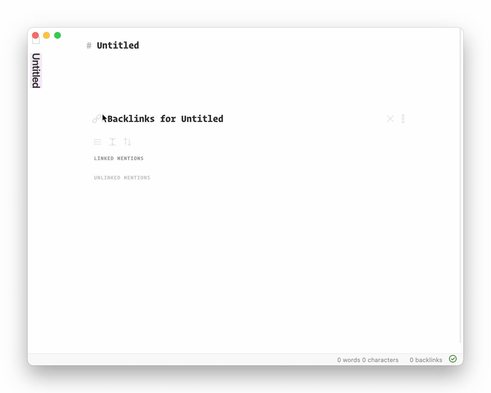

# Obsidian Filename Heading Sync

This is a Obsidian plugin to keep the filename and the first heading of a file in sync



**Note**: This plugin will overwrite your first heading at the top of the file the moment you open it, so this can be considered _destructive_.

Discussion on the obsidian forum [here](https://forum.obsidian.md/t/plugin-for-keeping-the-filename-and-first-heading-of-a-file-in-sync/12042)

## Features

- When renaming the current file -> will update the heading
- When opening a file that doesn't have a heading yet -> will insert one
- When opening a file with a different heading than the current file name -> will update the heading
- When updating the heading of a file -> will rename the file

If you're not a fan of automatic renaming you can also disable the "File Save Hook" and "File Open Hook" in settings and just use the manual sync commands (thanks @mnaoumov!)

## This plugin conflicts with plugin X, how do I solve this?

- First check if this is already solvable by adding a regex rule. For example if your file always ends in `myfile.foo.md` (ending `foo`), you can exclude this globally by adding the following regex rule in the plugins settings: `.*\.foo\.md`

- If that didn't do it, see if the other plugin acts on file-open. If it does, you can go into the settings of this plugin and disable the 'file open hook' as a workaround. (You can also fully disable automatic syncing by disabling 'file save hook' as well)

- If this still didn't solve the issue, [open a new issue](https://github.com/dvcrn/obsidian-filename-heading-sync/issues/new) with steps and examples how to reproduce the problem.

### Conflict with 'templater'

Disable the file-open hook in settings and they should play together nicely ([#40](https://github.com/dvcrn/obsidian-filename-heading-sync/issues/40))

## Current limitations and to do

- When renaming a file that isn't the current file, nothing will happen. The heading will get updated the next time the file is opened in edit mode
- [Special characters](https://github.com/dvcrn/obsidian-filename-header-sync/blob/bc3a1a7805f2b63ad5767c3d01dcef7b65b1aebd/main.ts) that obsidian can't handle will get auto-stripped

## Development

### Building the Plugin

To build the plugin for production:

```bash
npm run build
```

### Watch Mode with Auto-Sync to Obsidian

If you want to develop with automatic syncing to your Obsidian vault, you can set the `OBSIDIAN_PLUGIN_PATH` environment variable to point to your plugin directory:

```bash
export OBSIDIAN_PLUGIN_PATH="/path/to/your/vault/.obsidian/plugins/obsidian-filename-heading-sync"
npm run dev
```

The watch build will automatically copy the compiled plugin files to your Obsidian vault whenever changes are detected.

Alternatively, if you're using [just](https://github.com/casey/just), you can use:

```bash
export OBSIDIAN_PLUGIN_PATH="/path/to/your/vault/.obsidian/plugins/obsidian-filename-heading-sync"
just watch-sync
```

## LICENSE

MIT
